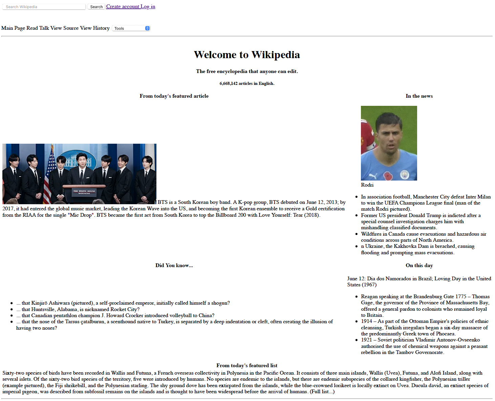

# 💻 Wikipedia clone 💻

## 🗞 What's it about?

A super simple Wikipedia clone (using only markup language), just to consolidate knowledge about HTML (especially table). It looks ugly, I know.

## 🗞 First look 

## 🗞 Technologies

+ HTML
